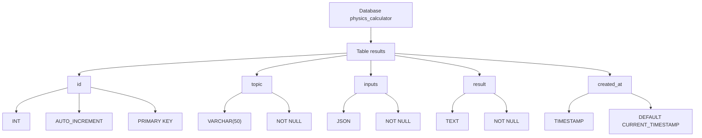

# Physics Calculator Server

## Table of Contents

1. Overview
2. Technologies Used
3. Installation
4. Database Architecture

## Overview

The Physics Calculator Server is a RESTful API application designed to store and retrieve calculation results for various physics-related topics. It provides endpoints for saving and fetching calculation results with timestamps.

## Technologies Used

| Technology | Description |
|------------|-------------|
| Node.js | JavaScript runtime environment |
| Express.js | Web framework for building APIs |
| MySQL | Relational database management system |
| mysql2 | MySQL driver for Node.js |
| CORS | Middleware for handling Cross-Origin Resource Sharing |
| dotenv | Environment variable management |
| Docker | Containerization platform |

## Installation

```bash
# Clone repository
git clone <repository-url>
cd physics-calculator-server

# Install dependencies
cd server
npm install

# Start server
npm start
```

## Database Architecture


